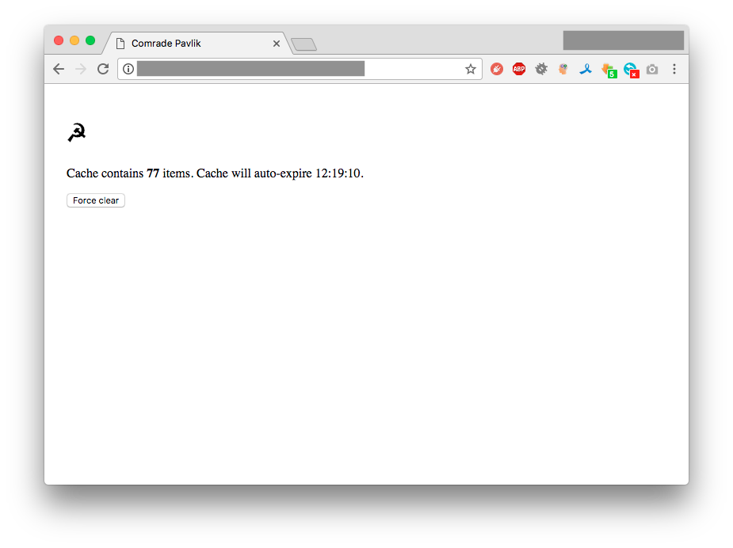

[](https://travis-ci.org/Dalee/comrade-pavlik2)
[](https://goreportcard.com/report/github.com/Dalee/comrade-pavlik2)
[](https://codebeat.co/projects/github-com-dalee-comrade-pavlik2-master)


# Private package registry: NPM, Yarn or Composer


> Photo is taken from Wikipedia.

Meet [Comrade Pavlik](https://en.wikipedia.org/wiki/Pavlik_Morozov).
Private `composer`, `npm` or `yarn` package registry with 
GitLab instance as package backend.

## Project goals

 * Private registry with GitLab instance as backend
 * Prevent leaving keys/tokens in Docker image
 * Access management via GitLab user tokens
 * Test npm/composer packages before publishing

## Supported software

 * [GitLab](https://about.gitlab.com/) `>= 8.5` (API `v3` and `v4` are supported)
 * [npm](https://github.com/npm/npm) `>= 2.5`
 * [yarn](https://yarnpkg.com) `>= 0.23.x`
 * [composer](https://getcomposer.org/) - any version should work without problems

## Setup

Let's assume:

 * You running GitLab instance as `gitlab.example.com`
 * You selected packages domain as `packages.example.com`
 * You created GitLab repository `gitlab.example.com/devops/packages.git`

### Source repository
 
So, what you should put to `gitlab.example.com/devops/packages.git`?
All you have to do, just put `repoList.json` with simple structure:
```
[
  {
    "acme": "git@gitlab.example.com/composer/my-package.git",
    "uuid": "<random generated uuid-v4 #1>",
    "tags": ["composer"]
  },
  {
    "acme": "https://gitlab.example.com/nodejs/my-package.git",
    "uuid": "<random generated uuid-v4 #2>",
    "tags": ["npm"]
  }
  ...
]
```

Where:
 * `acme` - scope name
 * `uuid` - UUID, will be used to format package download URL ([online generator](https://www.uuidgenerator.net/))
 * `tags` - define package type: currently supported: "composer" or "npm"

> Each private package should be described in `repoList.json`.

For `npm` or `yarn`, package name should be defined like this:
```
"name": "@acme/my-package",
```

For `composer`, package name should be defined like this:
```
"name": "acme/my-package",
```

> Actually, it's possible to shadow official Composer registry packages. 

### Running service

You have at least two options to configure Pavlik:
 * Put configuration options to `.env` file in project root
 * Put configuration options to environment variables

Configuration options:
 * `GITLAB_URL` - base GitLab endpoint - `http://gitlab.example.com`
 * `GITLAB_REPO_NAME` - namespace/project for repoList.json file - `devops/packages`
 * `GITLAB_FILE_NAMESPACE` - source namespace - `acme`
 * `GITLAB_REPO_FILE` - list of packages - `repoList.json`
 * `GITLAB_REPO_FILE_EXTRA_LIST` - optional, additional list of packages, comma-separated.

> To simplify deployment, you can use prebuild [docker image](https://hub.docker.com/r/dalee/comrade-pavlik2/) `dalee/comrade-pavlik2`.

Example systemd unit:
```
[Unit]
Description=Comrade Pavlik service
After=docker.service
Requires=docker.service

[Service]
TimeoutStartSec=0
Restart=always
ExecStartPre=-/usr/bin/docker stop %n
ExecStartPre=-/usr/bin/docker rm %n
ExecStart=/usr/bin/docker run --rm --name %n \
        -e "GITLAB_URL=http://gitlab.example.com" \
        -e "GITLAB_REPO_NAME=devops/packages" \
        -e "GITLAB_REPO_FILE=repoList.json" \
        -e "GITLAB_FILE_NAMESPACE=acme" \
        -e "GITLAB_REPO_FILE_EXTRA_LIST=composerList.json,npmList.json" \
        -p 8080:4000 \
        dalee/comrade-pavlik2:1.0.2

[Install]
WantedBy=multi-user.target
```
> Please check image version, stable version is >= 1.0.2

### Project setup

Grab user private token from `gitlab.example.com/profile/account` page.

#### Composer 

In project root or in `~/.composer` directory create `auth.json` with contents: 
```json
{
  "http-basic": {
    "packages.example.com": {
      "username": "gitlab username",
      "password": "gitlab user private token"
    }
  }
}
```

Add repository definition to composer.json
```
"repositories": [{
   "type": "composer",
   "url": "http://packages.example.com"
}]
```

In order to allow composer use http protocol, add this parameter to composer.json:
```
"config": {
    "secure-http": false
}
```

Add dependency:
```
"require": { 
    "acme/my-package": "^1.0.0" 
}
```

#### NPM/Yarn

In project root or in `~/` directory create `.npmrc` with contents:
```
@acme:registry=http://packages.example.com/
//packages.example.com/:_authToken=<gitlab user private token>
always-auth=true
```

Add dependency:
```json
"dependencies": {
  "@acme/my-package": "^1.0.0"
}
```

### CI/CD pipeline setup instructions

Do not put `auth.json` and `.npmrc` under version control!
 * composer - set `COMPOSER_AUTH` environment variable with contents of `auth.json` file
 * npm - set `NPM_TOKEN` environment variable and create `.npmrc` with following contents:
```
@acme:registry=http://packages.example.com/
//packages.example.com/:_authToken=${NPM_TOKEN}
```
 * for `yarn`, `always-auth=true` option is required in `.npmrc`.

#### CI/CD example

Setup NPM_TOKEN environment variable for Build Task. 
(You can use parameters for `TeamCity` or EnvInjector plugin for `Jenkins`).

`Dockerfile` steps (assuming project root is `/app` directory):
```
...
WORKDIR /app
COPY package.json npm-shrinkwrap.json /app/

RUN echo "@acme:registry=http://packages.example.com/\n\
//packages.example.com/:_authToken=\${NPM_TOKEN}" > /app/.npmrc

ARG NPM_TOKEN
RUN npm install --silent
...
```

And pass `NPM_TOKEN` environment variable for image build command:
```
docker build --build-arg NPM_TOKEN=${NPM_TOKEN} .
```

> Do not hardcode token into `--build-arg NPM_TOKEN=<token>`, use CI/CD environment 
variables, otherwise you may leak your token.

## Web UI

Depending on access level, private token may have access to a lot of repositories. 
Not all of them are useful, so Pavlik caches repository list for a relatively small 
amount of time (exactly 30 min, right now).

To clear or warm up cache, you can always use Web UI. Authorization credentials are 
the same as for composer `username:token`.



## Development

Pavlik uses wonderful `go-bindata` package for packing all assets
inside of executable. So, before development you need to:

 * install all dependencies 
 * create development version of templates

This can be done by using bundled `Makefile`
```
$ make install
$ make template-debug
```

## Licensing

Comrade Pavlik is licensed under the Apache License, Version 2.0. 
See LICENSE for the full license text.
